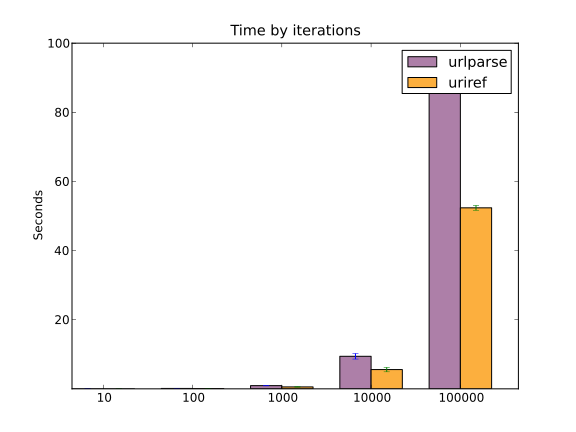

Python uriref
==============
:Last-Update: 2011-02-13
:Homepage: https://launchpad.net/uriref
:Description:
  URL and URN parser written in regular expressions. 
  Based on RFC 2396 BNF terms, update to RFC 3986 planned but not started.
:License: FreeBSD

This is an experimental library. Do not use it in production unless you are
prepared to put in considerable time for testing that it does what you need.
MIT License and warranties apply.

   uriref reference matching, compared to stdlib urlparse for several
   iteration-counts. The implementations are not tested for identical
   operation though.

`Coverage report`_ is available in html.
See `uriref <src/py/uriref.py>`__.

.. .. include:: src/py/uriref.py
      :start-line: 1
      :end-line: 181

.. vim:ft=rst:
