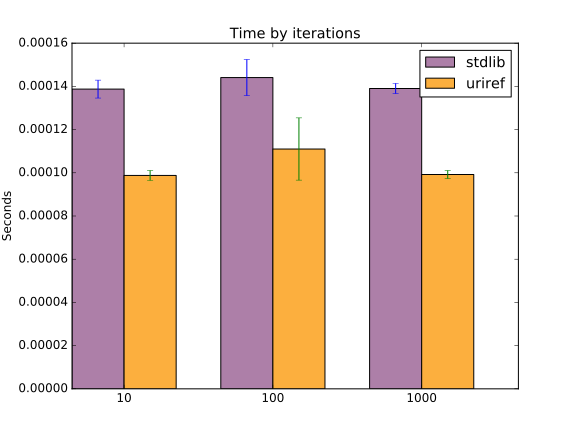

Python uriref
==============
:version: 0.0.2
:last-update: 2011-02-13
:description:
  URL and URN parser written in regular expressions. 
  Based on RFC 2396 BNF terms, update to RFC 3986 planned but not started.
:license: FreeBSD
:package status: 

  .. image:: https://gemnasium.com/dotmpe/uriref.png
     :target: https://gemnasium.com/dotmpe/uriref
     :alt: Dependencies

  .. image:: https://secure.travis-ci.org/dotmpe/uriref.png
     :target: https://travis-ci.org/dotmpe/uriref
     :alt: Build

:repository:

  .. image:: https://badge.fury.io/gh/dotmpe%2Furiref.png
     :target: http://badge.fury.io/gh/dotmpe%2Furiref
     :alt: GIT

This is an experimental library. Do not use it in production unless you are
prepared to put in time for testing that it does what you need.

   uriref reference matching, compared to stdlib urlparse for several
   iteration-counts. The implementations are not tested for identical
   operation.

   The diagram shows constant times for each iteration count.
   The regex implementation outperforms stdlib's urlparse module
   by almost 100%. The latter runs at slighty above 6e-4 seconds,
   with the former at ~3.5e-4 seconds (at my machine).

   Memory profiling remains to be done, I expect regex is taking a lot
   more.

There are almost 100 tests, a good bunch of which need to be reviewed (33
failures). The modules has 34% test coverage.

Installation of library and `parseuri.py` is via::

  python setup.py install

For lib source see `uriref <uriref/__init__.py>`__.

Tests
-----
::

  python test/py/main.py

Or::

  make test

`Coverage report <doc/htmlcov/index.html>`_ 
and `test results <doc/uriref_testreport.html>`_ are available in html.

There are tests that show for which sort of URLs uriref is compatible with
stdlib urlparse. 

TODO The setup should be fixed by splitting up the expected test results to
function. Currently there is one set of parameters for all test methods.

.. dont work on github
.. .. include:: uriref/__init__.py
      :start-line: 1
      :end-line: 189

.. vim:ft=rst:

